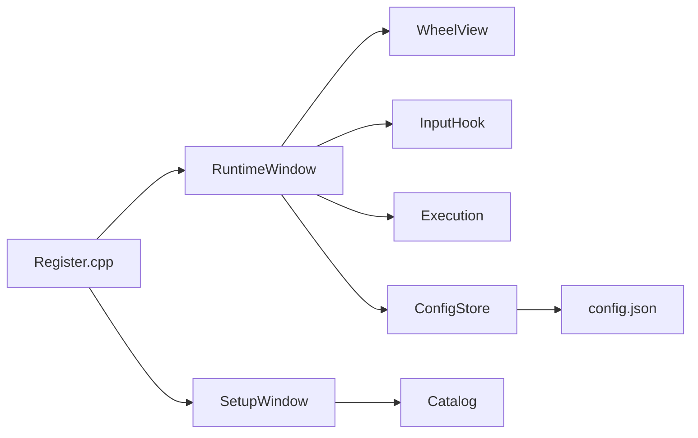

# 架构

## 总览

子菜单绘制与命中逻辑均在 `RuntimeWindow::tick()` 内联（无 `SubmenuView` / `RuntimeController` 类）。

## 定时器

与 Item Hub 相同：全局 `AppTimer` + `RegisterTimerCallback`，`RuntimeWindow::tick()` / `SetupWindow::tick()` 在回调中绘制。

## 线程

所有 REAPER API 与 ImGui 调用均在主线程（timer 回调）执行。

## Catalog

`RequestBuild()` 在 Setup 打开时启动；`TickBuild(max_per_frame)` 在 Setup `tick()` 与 Browser 绘制时分批枚举 Action/FX，避免首次打开长时间阻塞。

## 模块职责

| 模块 | 职责 |

|------|------|

| `ConfigStore` | 加载/保存 full config、preset、merge defaults、错误回退 |

| `Geometry` | `kPi` / `kStartOffset` 等共享常量 |

| `HitTest` | 扇区角、内圆、外半径死区 |

| `LayoutBake` | 子菜单尺寸（非 empty 槽）、屏幕夹取 |

| `Execution` | 插槽执行与 drop |

| `InputHook` | JS_VKeys 动态 `GetFunc` |

| `Catalog` | Action 列表、FX 扫描、模糊搜索（分帧） |

| `UiNotify` | `ShowUserMessage`、`DestroyImGuiContext` |

| `I18n` | 字符串表 |

## 平台

Windows 首期：`MonitorFromPoint`、`GetCursorPos`；高 DPI 多屏锚点见 README 限制。macOS 需后续 `platform/` 抽象。

